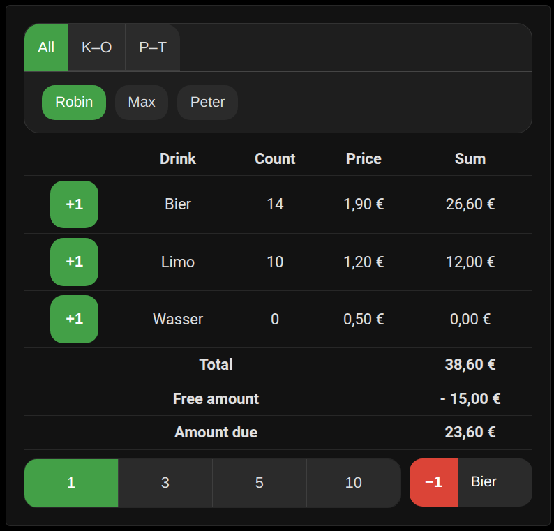

# Tally List Lovelace

🇬🇧 [Read English version](README.md)

Eine Lovelace-Karte für Home Assistant, die Getränkezähler pro Nutzer anzeigt und aktualisieren lässt. Nach der Auswahl eines Namens erscheinen die Anzahl der Getränke sowie der fällige Betrag. Nutzer und Preise werden automatisch aus der Tally‑List‑Integration gelesen. Währung und Sprache folgen den Home‑Assistant‑Einstellungen (Englisch und Deutsch, manuelle Auswahl möglich).

**Hinweis:** Für diese Karte wird die [Tally‑List‑Integration](https://github.com/Spider19996/ha-tally-list) benötigt.



## Installation

### Über HACS
1. Dieses Repository in HACS als **Custom Repository** (Kategorie **Lovelace**) hinzufügen.
2. **Tally List Card** aus dem HACS‑Store installieren.
3. HACS hält die Dateien aktuell. Die Freigetränke-Karte ist automatisch enthalten und benötigt keine zusätzliche Ressource.

### Manuell
1. `tally-list-card.js` in das `www`‑Verzeichnis von Home Assistant kopieren.
2. Folgende Ressourcen in Lovelace eintragen:
```yaml
- url: /local/tally-list-card.js
  type: module
```

Die Freigetränke-Karte wird automatisch geladen und benötigt keine separate Ressource.

### In Lovelace einbinden
Nach dem Hinzufügen der Ressource das Dashboard öffnen, **Karte hinzufügen** wählen und **Tally List Card** auswählen. Der Editor erlaubt die Konfiguration ohne YAML.

## Nutzung

### Automatische Konfiguration
```yaml
type: custom:tally-list-card
```
Alle von der Integration erkannten Nutzer erscheinen in der Auswahlliste. Administratoren (laut Tally‑List‑Integration) können jeden Nutzer wählen, normale Nutzer nur sich selbst. Getränkepreise stammen aus Sensoren `sensor.price_list_<getränk>_price`. Falls `sensor.price_list_free_amount` existiert, wird dieser Betrag jedem Nutzer gutgeschrieben. Sensoren `sensor.<name>_amount_due` überschreiben den berechneten Betrag.

Unter der Nutzerauswahl ermöglicht eine neue Buttonreihe, wie viele Getränke auf einmal hinzugefügt oder entfernt werden (1, 3, 5 oder 10). Die gewählte Anzahl wird hervorgehoben und für alle folgenden Aktionen verwendet.

Ein Klick auf **+X** fügt die ausgewählte Anzahl an Getränken hinzu:

```yaml
action: tally_list.add_drink
data:
  user: Robin
  drink: Wasser
  count: 3
```

Über den Button **Getränk entfernen** werden Getränke mit `tally_list.remove_drink` abgezogen. Wird `count` weggelassen, beträgt der Standardwert `1`.

## Konfigurationsoptionen

Folgende Optionen stehen im UI zur Verfügung:

* **Sperrzeit (ms)** – Wie lange die Buttons nach dem Drücken deaktiviert bleiben. Standard `400`.
* **Session-Timeout (s)** – Zeit bis zum automatischen Logout nach dem Login. Standard `30`.
* **Maximale Breite (px)** – Begrenzung der Kartenbreite. Standard `500`.
* **Entfernen-Menü anzeigen** – Ein-/Ausblenden des Menüs zum Entfernen.
* **Schrittweiten-Auswahl anzeigen** – Schaltflächen zur Auswahl der Schrittweite (1, 3, 5, 10) anzeigen.
* **Nur sich selbst zeigen** – Auswahl auch für Admins auf den eingeloggten Nutzer beschränken.
* **Sprache** – **Auto**, **Deutsch** oder **English** erzwingen.
* **Version** – Zeigt die installierte Version an.

## Betrag-Rangliste

Eine zweite Karte listet alle Nutzer nach offenem Betrag sortiert auf.

```yaml
type: custom:tally-due-ranking-card
```

Optionen:

* **Maximale Breite (px)** – Begrenzung der Kartenbreite.
* **sort_by** – `due_desc` (Standard), `due_asc` oder `name`.
* **sort_menu** – Dropdown zur Änderung der Sortierung anzeigen.
* **show_reset** – Admin-Reset-Button anzeigen.
* **show_total** – Gesamtbetrag aller Nutzer anzeigen.
* **max_entries** – Anzahl angezeigter Nutzer begrenzen (`0` = unbegrenzt).
* **hide_free** – Nutzer ohne offenen Betrag ausblenden.
* **show_copy** – Schaltfläche **Tabelle kopieren** anzeigen.

## Freigetränke-Karte

Bucht Freigetränke mit Pflichtkommentar. Zähler werden lokal gepuffert, bis sie abgeschickt werden. Mit dem Reset-Button lassen sich alle Zähler zurücksetzen. Vor der PIN-Eingabe muss ein Nutzer gewählt werden.

```yaml
type: custom:tally-list-free-drinks-card
```

Optionen:

* **show_prices** – Preise anzeigen (`true` standardmäßig).
* **comment_presets** – Vordefinierte Kommentarpräfixe. Jedes Element hat `label` und optional `require_comment`.
* **session_timeout_seconds** – Zeit bis zum automatischen Logout nach dem Login (`30` standardmäßig).
* **pin_lock_ms** – PIN-Sperrzeit in Millisekunden (`5000` standardmäßig).
* **free_drinks_timer_seconds** – Auto-Reset-Timer in Sekunden (`0` = aus).
* **free_drinks_per_item_limit** – Limit je Getränk (`0` = aus).
* **free_drinks_total_limit** – Gesamtlimit (`0` = aus).

Beispiel:

```yaml
type: custom:tally-list-free-drinks-card
comment_presets:
  - label: Einsatz
    require_comment: true
  - label: Übung
    require_comment: false
```

