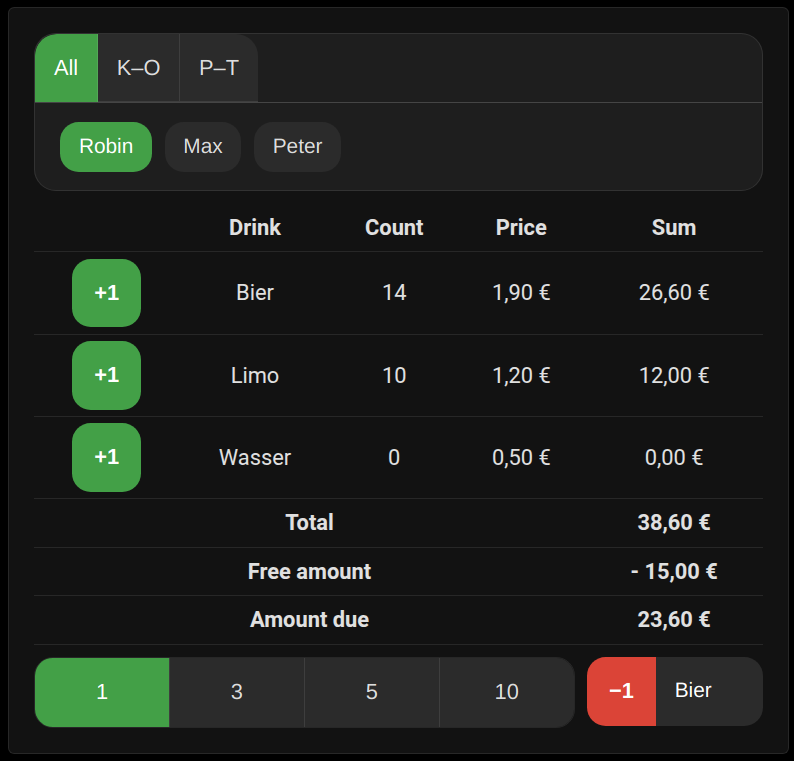

# Tally List Lovelace

🇩🇪 [Deutsche Version lesen](README.de.md)

A Lovelace card for Home Assistant that displays drink tallies per user and allows updating them. Selecting a name shows drink counts and the amount owed. Prices and users are read automatically from the Tally List integration. Currency and language follow Home Assistant settings (English and German supported, with optional override).

**Note:** This card requires the [Tally List integration](https://github.com/Spider19996/ha-tally-list).



## Installation

### Via HACS
1. Add this repository as a **Custom Repository** in HACS (category **Lovelace**).
2. Install **Tally List Card** from the HACS store.
3. HACS keeps the files up to date. The Free Drinks Card is included automatically and requires no extra resource.

### Manual
1. Copy `tally-list-card.js` to your Home Assistant `www` directory.
2. Add to your Lovelace resources:
```yaml
- url: /local/tally-list-card.js
  type: module
```

The Free Drinks Card is loaded automatically and needs no separate resource.

### Add to Lovelace
After the resource is available, open the dashboard, choose **Add Card**, and select **Tally List Card**. The editor lets you configure options without YAML.

## Usage

### Automatic configuration
```yaml
type: custom:tally-list-card
```
All users detected by the integration appear in the selector. By default this is a dropdown list, but admins (as defined in the Tally List integration) may switch to tabs or a button grid via the `user_selector` option. Regular users only see their own name and cannot change it. Drink prices are taken from sensors named `sensor.price_list_<drink>_price`. If `sensor.price_list_free_amount` exists, its value is deducted from each user's total. Sensors named `sensor.<name>_amount_due` override the calculated amount due.

Below the user selection a row of buttons lets you choose how many drinks to add or remove at once (1, 3, 5, or 10). The highlighted value is used for all subsequent actions.

Pressing **+X** adds the selected number of drinks:

```yaml
action: tally_list.add_drink
data:
  user: Robin
  drink: Wasser
  count: 3
```

The **Remove drink** button subtracts drinks with a `tally_list.remove_drink` call. If `count` is omitted, both services default to `1`.

## Configuration options

The card offers the following options in the UI:

* **Lock time (ms)** – Duration the buttons stay disabled after pressing them. Default `400`.
* **Maximum width (px)** – Limit card width. Default `500`.
* **Show remove menu** – Enable/disable the remove-drink dropdown.
* **Show step selection** – Show buttons to select the step size (1, 3, 5, 10).
* **Only show self** – Limit selection to the logged‑in user even for admins.
* **User selector** – Choose between **list**, **tabs**, or **grid** for selecting users.
* **Language** – Force **Auto**, **Deutsch**, or **English**.
* **Version** – Display the installed version.

## Amount Due Ranking

A second card lists all users ordered by outstanding amount.

```yaml
type: custom:tally-due-ranking-card
```

Options:

* **Maximum width (px)** – Limit card width.
* **sort_by** – `due_desc` (default), `due_asc`, or `name`.
* **sort_menu** – Show a dropdown to change the sort order.
* **show_reset** – Show the admin reset button.
* **show_total** – Display the total outstanding amount.
* **max_entries** – Limit how many users are shown (`0` = no limit).
* **hide_free** – Hide users who owe nothing.
* **show_copy** – Show the "Tabelle kopieren" button.
* **show_step_select** – Show buttons to select the step size.

## Free Drinks Card

Book free drinks with a mandatory comment. Counts are kept locally until submitted. Use the reset button to clear all counts.

```yaml
type: custom:tally-list-free-drinks-card
```

Options:

* **show_prices** – Display drink prices (`true` by default).
* **comment_presets** – Predefine comment prefixes. Each entry has a `label` and optional `require_comment`.
* **free_drinks_timer_seconds** – Auto-reset timer in seconds (`0` to disable).
* **free_drinks_per_item_limit** – Maximum free drinks per item (`0` to disable).
* **free_drinks_total_limit** – Maximum free drinks overall (`0` to disable).

Example:

```yaml
type: custom:tally-list-free-drinks-card
comment_presets:
  - label: Einsatz
    require_comment: true
  - label: Übung
    require_comment: false
```

