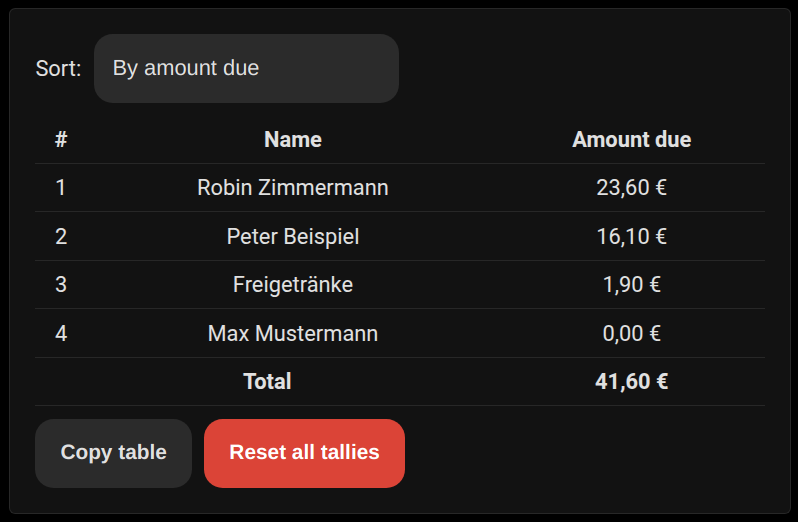
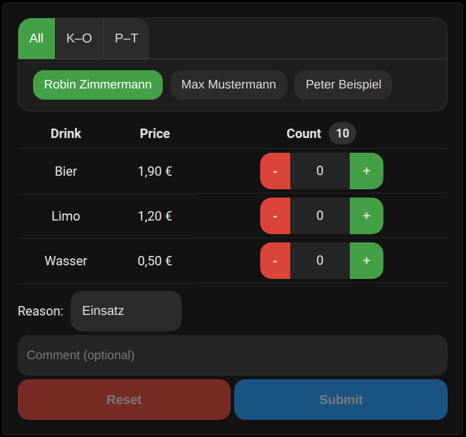
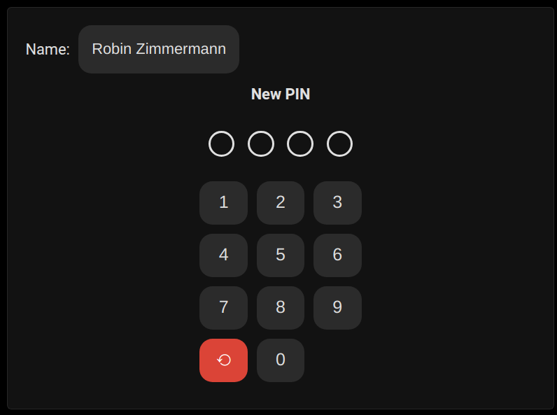

# Tally List Lovelace

🇩🇪 [Deutsche Version lesen](README.de.md)

A Lovelace card for Home Assistant that displays drink tallies per user and allows updating them. Selecting a name shows drink counts and the amount owed. Prices and users are read automatically from the Tally List integration. Currency and language follow Home Assistant settings (English and German supported, with optional override).

<p align="center">
  
  
  
  
</p>

## Features

* Shows drink counts per user, the amount owed, and current credit
* Add or remove drinks with an adjustable step size
* Automatic user and price detection from the Tally List integration
* English and German language support with auto detection
* Includes additional cards:
  * **Amount Due Ranking** – list users ordered by outstanding amount
  * **Free Drinks** – book free drinks with a mandatory comment
  * **PIN Set** – let users set or reset their 4-digit PIN

## Requirements

* Home Assistant
* [Tally List integration](https://github.com/Spider19996/ha-tally-list)

## Installation

### Via HACS
1. Add this repository as a **Custom Repository** in HACS (category **Lovelace**).
2. Install **Tally List Card** from the HACS store.
3. HACS keeps the files up to date.

### Manual
1. Copy `tally-list-card.js` to your Home Assistant `www` directory.
2. Add to your Lovelace resources:
```yaml
- url: /local/tally-list-card.js
  type: module
```

### Add to Lovelace
After the resource is available, open the dashboard, choose **Add Card**, and select **Tally List Card**. The editor lets you configure options without YAML.

## Usage

### Automatic configuration
```yaml
type: custom:tally-list-card
```
All users detected by the integration appear in the selector. By default this is a dropdown list, but admins (as defined in the Tally List integration) may switch to tabs or a grid of chips via the `user_selector` option. Regular users only see their own name and cannot change it. Drink prices are taken from sensors named `sensor.price_list_<drink>_price`. If `sensor.price_list_free_amount` exists, its value is deducted from each user's total. Sensors named `sensor.<name>_amount_due` override the calculated amount due.

Below the user selection a row of buttons lets you choose how many drinks to add or remove at once (1, 3, 5, or 10). The highlighted value is used for all subsequent actions.

Pressing **+X** adds the selected number of drinks:

```yaml
action: tally_list.add_drink
data:
  user: Robin
  drink: Wasser
  count: 3
```

The **Remove drink** button subtracts drinks with a `tally_list.remove_drink` call. If `count` is omitted, both services default to `1`.

## Configuration options

The card offers the following options in the UI:

* **Lock time (ms)** – Duration the buttons stay disabled after pressing them. Default `400`.
* **Session timeout (s)** – Time after login before automatic logout. Default `30`.
* **Maximum width (px)** – Limit card width. Default `500`.
* **Show remove menu** – Enable/disable the remove-drink dropdown.
* **Show step selection** – Show buttons to select the step size (1, 3, 5, 10).
* **Show credit** – Display a line with the amount already paid or owed.
* **Only show self** – Limit selection to the logged‑in user even for admins.
* **Shorten user names** – Abbreviate names in the selector while keeping them unique.
* **User selector** – Choose between **list**, **tabs**, or **grid** for selecting users.
* **Language** – Force **Auto**, **Deutsch**, or **English**.
* **Version** – Display the installed version.

## Amount Due Ranking

A second card lists all users ordered by outstanding amount.

```yaml
type: custom:tally-due-ranking-card
```

Options:

* **Maximum width (px)** – Limit card width.
* **sort_by** – `due_desc` (default), `due_asc`, or `name`.
* **sort_menu** – Show a dropdown to change the sort order.
* **show_reset** – Show the admin reset button.
* **show_total** – Display the total outstanding amount.
* **max_entries** – Limit how many users are shown (`0` = no limit).
* **hide_free** – Hide users who owe nothing.
* **show_copy** – Show the "Tabelle kopieren" button.
* **shorten_user_names** – Abbreviate user names in the table.

## Free Drinks Card

Book free drinks with a mandatory comment. Counts are kept locally until submitted. Use the reset button to clear all counts. A user must be selected before entering the PIN.

```yaml
type: custom:tally-list-free-drinks-card
```

Options:

* **show_prices** – Display drink prices (`true` by default).
* **comment_presets** – Predefine comment prefixes. Each entry has a `label` and optional `require_comment`.
* **session_timeout_seconds** – Time after login before automatic logout (`30` by default).
* **pin_lock_ms** – PIN lock duration in milliseconds (`5000` by default).
* **max_width** – Maximum card width in pixels (`500` by default).
* **free_drinks_timer_seconds** – Auto-reset timer in seconds (`0` to disable).
* **free_drinks_per_item_limit** – Maximum free drinks per item (`0` to disable).
* **free_drinks_total_limit** – Maximum free drinks overall (`0` to disable).
* **only_self** – Only show the current user even for admins.
* **shorten_user_names** – Abbreviate user names in the selector.

Example:

```yaml
type: custom:tally-list-free-drinks-card
comment_presets:
  - label: Einsatz
    require_comment: true
  - label: Übung
    require_comment: false
```


## PIN Set Card

Allow users to set or reset their 4-digit PIN. Administrators can select any user and update the PIN for them. The card is available in the Lovelace card picker.
When opened, a configurable warning can remind users not to use important PINs such as their bank card PIN. Leave the warning text empty to disable it.

```yaml
type: custom:tally-set-pin-card
```

The card uses the same user list as the main Tally List card and normally requires no additional configuration.

Options:

* **lock_ms** – Lock duration in milliseconds after each PIN attempt (`5000` by default).
* **max_width** – Maximum card width in pixels (`500` by default).
* **user_selector** – User selection layout: `list`, `tabs`, or `grid` (`list` by default).
* **shorten_user_names** – Abbreviate user names in the selector.
* **only_self** – Only show the current user even for admins.
* **pin_warning** – Warning text shown when opening the card. Supports line breaks and simple Markdown for _italic_, **bold**, and __underline__. Set to an empty string to hide the warning. Default: "**Do not use an important PIN (e.g., your bank card PIN).** PINs are stored encrypted, but there is no guarantee they will not fall into the wrong hands."

It calls the `tally_list.set_pin` service to store the new code, e.g.:

```yaml
action: tally_list.set_pin
data:
  user: Erika Mustermann
  pin: "1234"
```

## Log Feed Markdown Card

Display recent actions from the log feed sensor in a Markdown card.

```yaml
type: markdown
content: |
  
  
  

  {% set action_map = {
    'add_drink': 'Drink booked',
    'add_free_drink': 'Free drinks added',
    'remove_drink': 'Drink removed',
    'edit_drink': 'Drink edited',
    'set_drink': 'Drink set',
    'set_pin': 'PIN set',
    'add_drink_type': 'Drink type added',
    'remove_drink_type': 'Drink type removed',
    'enable_logging': 'Logging enabled',
    'disable_logging': 'Logging disabled',
    'enable_log_drinks': 'Drink logging enabled',
    'disable_log_drinks': 'Drink logging disabled',
    'enable_log_price_changes': 'Price change logging enabled',
    'disable_log_price_changes': 'Price change logging disabled',
    'enable_log_free_drinks': 'Free drink logging enabled',
    'disable_log_free_drinks': 'Free drink logging disabled',
    'enable_log_pin_set': 'PIN change logging enabled',
    'disable_log_pin_set': 'PIN change logging disabled',
    'authorize_public': 'Public device authorized',
    'unauthorize_public': 'Public device removed',
    'grant_admin': 'Admin rights granted',
    'revoke_admin': 'Admin rights revoked',
    'include_user': 'User included',
    'exclude_user': 'User excluded',
    'set_free_amount': 'Free amount set',
    'set_credit': 'Credit set'
  } %}

  

  
  
  {% set date = as_timestamp(as_datetime(e.time_local)) | timestamp_custom("%d.%m.%Y %H:%M") %}
  

  
  {{ base }} → {{ raw | regex_replace(':set$','') }}

  
  
  
  {{ base }} → {{ parts | map('replace','log_drinks', module_map['log_drinks'])
                   | map('replace','log_price_changes', module_map['log_price_changes'])
                   | map('replace','log_free_drinks', module_map['log_free_drinks'])
                   | map('replace','log_pin_set', module_map['log_pin_set'])
                   | map('replace','log_settings', module_map['log_settings'])
                   | join(', ') }}
  
  {{ base }}
  

  
  {{ base }} → {{ raw }}

  
  
  
  
  {{ base }} → {{ drink }}: {{ "%.2f"|format(parts[0]|float) }} € → {{ "%.2f"|format(parts[1]|float) }} €

  
  
  {{ base }} → {{ "%.2f"|format(parts[0]|float) }} € → {{ "%.2f"|format(parts[1]|float) }} €

  
  
  {{ base }} → {{ parts[0] }}: {{ "%.2f"|format(parts[1]|float) }} €

  
  
  
  {{ base }} → {{ parts[0] }} = {{ "%.2f"|format(parts[1]|float) }} €

  
  {{ base }} → {{ raw.split(':')[-1] }}

  
  
  {{ base }} → {{ p | replace(':',': ') }}{{ ', ' if not loop.last else '' }}
  
  
``` 

